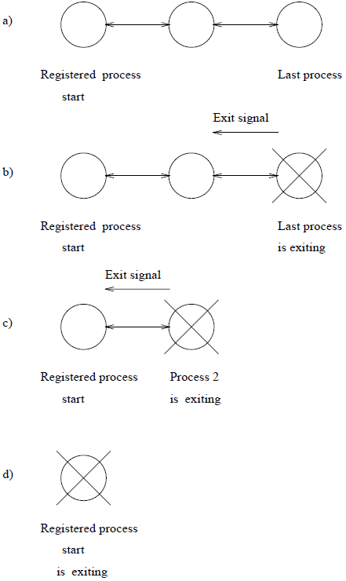
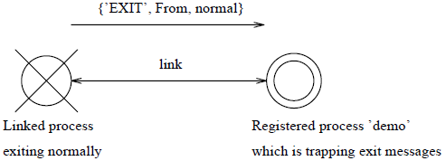
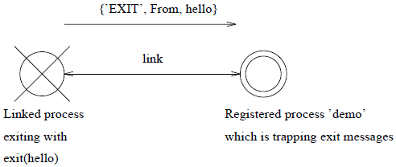

.. highlight:: erlang
   :linenothreshold: 3

**************
第7章 错误处理
**************

:翻译: 丁豪
:校对: 连城

即便是Erlang程序员也难免会写出有问题的程序。代码中的语法错误（和一些语义错误）可以借助编译器检测出来，但程序仍可能含有逻辑错误。对需求理解的偏差或对需求实现的不完备所造成的逻辑错误只能通过大量的一致性测试来检测。其他的错误则以运行时错误的形式出现。

函数是在Erlang进程中执行的。函数可能出于多种原因而失败，比如：

- 一次匹配操作失败
- 使用错误的参数调用BIF
- 我们可能打算对一个算术表达式求值，然而其中的一个项式并不是数值

Erlang本身当然无法修正这些情况，但它为程序员提供了一些检测和处理失败情况的机制。借助这些机制，程序员可以设计出健壮和容错的系统。Erlang具备如下机制：

- 监视表达式的求值
- 监视其他进程的行为
- 捕获对未定义函数的求值
    
Catch和Throw
============

``catch``\ 和\ ``throw``\ 提供了一种表达式求值的监视机制，可以用于

- 处理顺序代码中的错误（\ ``catch``\ ）
- 函数的非本地返回（\ ``catch``\ 结合\ ``throw``\ ）

表达式求值失败（如一次匹配失败）的一般后果是导致求值进程的异常退出。通过以下方式可以借助\ ``catch``\ 来更改这个默认行为：

.. code-block:: erlang

    catch Expression

若表达式的求值过程没有发生错误，则\ ``catch Expression``\ 返回\ ``Expression``\ 的值。于是\ ``catch atom_to_list(abc)``\ 会返回\ ``[97,98,99]``\ 、\ ``catch 22``\ 会返回\ ``22``\ 。

若求值过程失败，\ ``catch Expression``\ 将返回元组\ ``{'EXIT', Reason}``\ ，其中\ ``Reason``\ 是用于指明错误原因的原子式（参见第??节）。于是\ ``catch an_atom - 2``\ 会返回\ ``{'EXIT', badarith}``\ 、\ ``catch atom_to_list(123)``\ 会返回\ ``{'EXIT', badarg}``\ 。

函数执行结束后，控制流程便返还者。\ ``throw/1``\ 可以令控制流程跳过调用者。如果我们像上述的那样计算\ ``catch Expression``\ ，并在\ ``Expression``\ 的求值过程中调用\ ``throw/1``\ ，则控制流程将直接返回至\ ``catch``\ 。注意\ ``catch``\ 可以嵌套；在嵌套的情况下，一次失败或\ ``throw``\ 将返回至最近的\ ``catch``\ 处。在\ ``catch``\ 之外调用\ ``throw/1``\ 将导致运行时错误。

下面的例子描述了\ ``catch``\ 和\ ``throw``\ 的行为。定义函数\ ``foo/1``\ ：

.. code-block:: erlang

    foo(1) ->
        hello;
    foo(2) ->
        throw({myerror, abc});
    foo(3) ->
        tuple_to_list(a);
    foo(4) ->
        exit({myExit, 222}).

假设在不使用\ ``catch``\ 的情况下，一个进程标识为\ ``Pid``\ 的进程执行了这个函数，则：

``foo(1)``

    返回\ ``hello``\ 。

``foo(2)``

    执行\ ``throw({myerror,abc})``\ 。由于不在\ ``catch``\ 的作用域内，执行\ ``foo(2)``\ 的进程将出错退出。

``foo(3)``

    执行\ ``foo(3)``\ 的进程执行BIF ``tuple_to_list(a)``\ 。这个BIF用于将元组转换为列表。在这个例子中，参数不是元组，因此该进程将出错退出。

``foo(4)``

    执行BIF ``exit/1``\ 。由于不在\ ``catch``\ 的范围内，执行\ ``foo(4)``\ 的函数将退出。很快我们就会看到参数\ ``{myExit,222}``\ 的用途。

``foo(5)``

    执行\ ``foo(5)``\ 的进程将出错退出，因为函数\ ``foo/1``\ 的首部无法匹配\ ``foo(5)``\ 。

现在让我们来看看在\ ``catch``\ 的作用域内对\ ``foo/1``\ 以相同的参数进行求值会发生什么：

.. code-block:: erlang

    demo(X) ->
        case catch foo(X) of
            {myerror, Args} ->
                {user_error, Args};
            {'EXIT', What} ->
                {caught_error, What};
            Other ->
                Other
        end.

``demo(1)``

    像原来一样执行\ ``hello``\ 。因为没有任何失败发生，而我们也没有执行\ ``throw``\ ，所以\ ``catch``\ 直接返回\ ``foo(1)``\ 的求值结果。

``demo(2)``

    求值结果为\ ``{user_error,abc}``\ 。对\ ``throw({myerror,abc})``\ 的求值导致外围的\ ``catch``\ 返回\ ``{myerror, abc}``\ 同时\ ``case``\ 语句返回\ ``{user_error,abc}``\ 。

``demo(3)``

    求值结果为\ ``{caught_error,badarg}``\ 。\ ``foo(3)``\ 执行失败导致\ ``catch``\ 返回\ ``{'EXIT',badarg}``\ 。

``demo(4)``

    求值结果为\ ``{caught_error,{myexit,222}}``\ 。

``demo(5)``

    求值结果为\ ``{caught_error,function_clause}``\ 。

注意，在\ ``catch``\ 的作用域内，借助\ ``{'EXIT', Message}``\ ，你能够很容易地“伪造”一次失败——这是一个\ **设计决策**\ [#]_\ 。

使用catch和throw抵御不良代码
----------------------------

下面来看一个简单的Erlang shell脚本：

.. code-block:: erlang

    -module(s_shell).
    -export([go/0]).

    go() ->
        eval(io:parse_exprs('=> ')),    % '=>' is the prompt
        go().

    eval({form,Exprs}) ->
        case catch eval:exprs(Exprs, []) of % Note the catch
            {'EXIT', What} ->
                io:format("Error: ~w!~n", [What]);
            {value, What, _} ->
                io:format("Result: ~w~n", [What])
        end;
    eval(_) ->
        io:format("Syntax Error!~n", []).

标准库函数\ ``io:parse_exprs/1``\ 读取并解析一个Erlang表达式，若表达式合法，则返回\ ``{form,Exprs}``\ 。

正确情况下，应该匹配到第一个子句\ ``eval({form,Expr})``\ 并调用库函数\ ``eval:exprs/2``\ 对表达式进行求值。由于无法得知表达式的求值过程是否为失败，我们在此使用\ ``catch``\ 进行保护。例如，对\ ``1 - a``\ 进行求值将导致错误，但在\ ``catch``\ 内对\ ``1 - a``\ 求值就可以捕捉这个错误\ [#]_\ 。借助\ ``catch``\ ，在求值失败时，\ ``case``\ 子句与模式\ ``{'EXIT',what}``\ 匹配，在求值成功时则会与\ ``{value, What, _}``\ 匹配。

使用catch和throw实现函数的非本地返回
------------------------------------

假设我们要编写一个用于识别简单整数列表的解析器，可以编写如下的代码：

.. code-block:: erlang

    parse_list(['[',']' | T])
        {nil, T};
    parse_list(['[', X | T]) when integer(X) ->
        {Tail, T1} = parse_list_tail(T),
        {{cons, X, Tail}, T1}.

    parse_list_tail([',', X | T]) when integer(X) ->
        {Tail, T1} = parse_list_tail(T),
        {{cons, X, Tail}, T1};
    parse_list_tail([']' | T]) ->
        {nil, T}.

例如：

.. code-block:: erlang

    > parse_list(['[',12,',',20,']']).
    {{cons,12,{cons,20,nil}},[]}

要是我们试图解析一个非法的列表，就会导致如下的错误：

.. code-block:: erlang

    > try:parse_list(['[',12,',',a]).
    !!! Error in process <0.16.1> in function
    !!!     try:parse_list_tail([',',a])
    !!! reason function_clause
    ** exited: function_clause **

如果我们想在跳出递归调用的同时仍然掌握是哪里发生了错误，可以这样做：

.. code-block:: erlang

    parse_list1(['[',']' | T]) ->
        {nil, T};
    parse_list1(['[', X | T]) when integer(X) ->
        {Tail, T1} = parse_list_tail1(T),
        {{cons, X, Tail}, T1};
    parse_list1(X) ->
        throw({illegal_token, X}).

    parse_list_tail1([',', X | T]) when integer(X) ->
        {Tail, T1} = parse_list_tail1(T),
        {{cons, X, Tail}, T1};
    parse_list_tail1([']' | T]) ->
        {nil, T};
    parse_list_tail1(X) ->
        throw({illegal_list_tail, X}).

现在，如果我们在\ ``catch``\ 里对\ ``parse_list/1``\ 求值，将获得以下结果：

.. code-block:: erlang

    > catch parse_list1(['[',12,',',a]).
    {illegal_list_tail,[',',a]}

通过这种方式，我们得以从递归中直接退出，而不必沿着通常的递归调用路径逐步折回。

进程终止
========

当一个进程的进程执行函数（通过\ ``spawn/4``\ 创建进程时第3个参数所指定的函数）执行完毕，或是（在\ ``catch``\ 之外）执行\ ``exit(normal)``\ ，便会正常退出。参见程序7.1：

``test:start()``

    创建一个注册名为\ ``my_name``\ 的进程来执行\ ``test:process()``\ 。

.. topic:: 程序7.1

    .. code-block:: erlang

        -module(test).
        -export([process/0, start/0]).
        start() ->
            register(my_name, spawn(test, process, [])).
        process() ->
            receive
                 {stop, Method} ->
                     case Method of
                          return ->
                              true;
                          Other ->
                              exit(normal)
                     end;
                 Other ->
                     process()
            end.

``my_name ! {stop, return}``

    令\ ``test:process()``\ 返回\ ``true``\ ，接着进程正常终止。

``my_name ! {stop, hello}``

    也会令进程正常终止，因为它执行了BIF ``exit(normal)``\ 。

任何其它的消息，比如\ ``my_name ! any_other_message``\ 都将令进程递归执行\ ``test:process()``\ （采用尾递归优化的方式，参见第??章）从而避免进程终止。

若进程执行BIF ``exit(Reason)``\ ，则进程将异常终止。其中\ ``Reason``\ 是\ **除了**\ 原子式\ ``normal``\ 以外的任意的Erlang项式。如我们所见，在\ ``catch``\ 上下文中执行\ ``exit(Reason)``\ 不会导致进程退出。

进程在执行到会导致运行时失败的代码（如除零错误）时，也会异常终止。后续还会讨论各种类型的运行时失败。

链接进程
========

进程可以互相监视。这里要引入两个概念，进程\ **链接**\ 和\ ``EXIT``\ 信号。在执行期间，进程可以与其他进程（和端口，参见??章节）建立链接。当一个进程终止（无论正常或非正常终止）时，一个特殊的\ ``EXIT``\ 信号将被发送到所有与即将终止的进程相链接的进程（及端口）。该信号的格式如下：

.. code-block:: erlang

    {'EXIT', Exiting_Process_Id, Reason}

``Exiting_Process_Id``\ 是即将终止的进程的进程标识，\ ``Reason``\ 可以是任意的Erlang项式。

收到\ ``Reason``\ 不是原子式\ ``normal``\ 的\ ``EXIT``\ 信号时，信号接收进程的默认动作是立即终止并，同时向当前与之链接的进程发送\ ``EXIT``\ 信号。默认情况下，\ ``Reason``\ 为原子式\ ``normal``\ 的\ ``EXIT``\ 信号将被忽略。

``EXIT``\ 信号的默认处理方式行为可以被覆写，以允许进程在接收到\ ``EXIT``\ 信号时采取任意必要的动作。

创建和删除链接
--------------

进程可以链接到其它进程和端口。进程间的链接都是双向的，也就是说，如果进程A链接到进程B，那么进程B也会自动链接到进程A。

通过执行BIF ``link(Pid)``\ 便可创建链接。调用\ ``link(Pid)``\ 时，若调用进程和\ ``Pid``\ 之间已经存在链接，则不会产生任何影响。

进程终止时，它所持有的链接都将被删除。也可以通过执行BIF ``unlink(Pid)``\ 显式删除链接。由于所有链接都是双向的，删除这一端到另一端的链接的同时，另一端的到这一端的链接也会被删除。若调用进程和\ ``Pid``\ 之间原本就没有链接，\ ``unlink(Pid)``\ 不会产生任何影响。

BIF ``spawn_link/3``\ 在创建新进程的同时还会在调用进程和新进程间建立链接。其行为可以定义为：

.. code-block:: erlang

    spawn_link(Module, Function, ArgumentList) ->
        link(Id = spawn(Module, Function, ArgumentList)),
        Id.

只不过\ ``spawn``\ 和\ ``link``\ 是原子方式执行的。这是为了避免调用进程在执行\ ``link``\ 之前就被\ ``EXIT``\ 信号杀死。尝试向一个不存在的进程发起链接将导致信号\ ``{'EXIT', Pid, noproc}``\ 被发送至\ ``link(Pid)``\ 的调用进程。

程序7.2中，函数\ ``start/1``\ 建立了若干以链式互联的进程，其中第一个进程的注册名为\ ``start``\ （参见图7.1）。函数\ ``test/1``\ 向该注册进程发送消息。每个进程不断打印自己在链中的位置及收到的消息。消息\ ``stop``\ 令链中最后一个进程执行BIF ``exit(finished)``\ ，该BIF将导致该进程异常终止。

.. topic:: 程序7.2

    .. code-block:: erlang

        -module(normal).
        -export([start/1, p1/1, test/1]).

        start(N) ->
            register(start, spawn_link(normal, p1, [N - 1])).

        p1(0) ->
            top1();
        p1(N) ->
            top(spawn_link(normal, p1, [N - 1]),N).

        top(Next, N) ->
            receive
                 X ->
                     Next ! X,
                     io:format("Process ~w received ~w~n", [N,X]),
                     top(Next,N)
            end.

        top1() ->
            receive
                 stop ->
                     io:format("Last process now exiting ~n", []),
                     exit(finished);
                 X ->
                     io:format("Last process received ~w~n", [X]),
                     top1()
            end.

        test(Mess) ->
            start ! Mess.

我们启动三个进程（参见图7.1(a)）

.. code-block:: erlang

    > normal:start(3).
    true

    图7.1 进程退出信号的传递

然后向第一个进程发送消息\ ``123``\ ：

.. code-block:: erlang

    > normal:test(123).
    Process 2 received 123
    Process 1 received 123
    Last process received 123
    123

再向第一个进程发送消息\ ``stop``\ ：

.. code-block:: erlang

    > normal:test(stop).
    Process 2 received stop
    Process 1 received stop
    Last process now exiting
    stop

这条消息顺着进程链传递下去，我们将看到它最终导致链中最后一个进程的终止。这会引发一个发送给倒数第二个进程的\ ``EXIT``\ 信号，致其异常终止（图7.1(b)），接着又向第一个进程发送\ ``EXIT``\ 信号（图7.1(c)），于是注册进程\ ``start``\ 也异常终止（图 7.1(d)）。

若这时再向注册进程\ ``start``\ 发送一条新消息，将由于目标进程不存在而失败：

.. code-block:: erlang

    > normal:test(456).
    !!! Error in process <0.42.1> in function
    !!!     normal:test(456)
    !!! reason badarg
    ** exited: badarg **

运行时失败
==========

如前所述，\ ``catch``\ 作用域以外的运行时失败将导致进程的异常终止。进程终止时，将向与其链接的所有进程发送\ ``EXIT``\ 信号。这些信号包括一个指明失败原因的原子式。常见的失败原因如下：

``badmatch``

    匹配失败。例如，尝试匹配\ ``1 = 3``\ 的进程将终止并向链接进程发送\ ``EXIT``\ 信号\ ``{'EXIT', From, badmatch}``\ 。

``badarg``

    BIF调用参数错误。例如，执行\ ``atom_to_list(123)``\ 将导致调用进程终止，并向链接进程发送\ ``EXIT``\ 信号\ ``{'EXIT', From, badarg}``\ 。因为\ ``123``\ 不是原子式。

``case_clause``

    缺少匹配的\ ``case``\ 语句分支。例如，若进程执行：

    .. code-block:: erlang

        M = 3,
        case M of
             1 ->
                 yes;
             2 ->
                 no
        end.

    则进程将终止，并向所有链接进程发送\ ``EXIT``\ 信号\ ``{'EXIT', From, case_clause}``\ 。

``if_clause``

    缺少匹配的\ ``if``\ 语句分支。例如，若进程执行：

    .. code-block:: erlang

        M = 3,
        if
             M == 1 ->
                 yes;
             M == 2 ->
                 no
        end.

    则进程将终止，并向所有链接进程发送\ ``EXIT``\ 信号\ ``{'EXIT', From, if_clause}``\ 。

``function_clause``

    缺少能够匹配函数调用参数列表的函数首部。例如，对如下的\ ``foo/1``\ 定义调用\ ``foo(3)``\ ：

    .. code-block:: erlang

        foo(1) ->
             yes;
        foo(2) ->
             no.

    则调用进程终止，并向所有链接进程发送\ ``EXIT``\ 信号\ ``{'EXIT', From, function_clause}``\ 。

``undef``

    尝试执行未定义函数的进程将终止并向所有链接进程发送\ ``{'EXIT', From, undef}``\ （参见第??节）。

``badarith``

    执行非法算术表达式（如，\ ``1 + foo``\ ）将导致进程终止，并向所有链接进程发送\ ``{'EXIT', Pid, badarith}``\ 。

``timeout_value``

    \ ``receive``\ 表达式中出现非法超时值；如超时值既不是整数也不是原子式\ ``infinity``\ 。

``nocatch``

    执行了\ ``throw``\ 语句却没有对应的\ ``catch``\ 。

自定义默认的信号接收动作
========================

BIF ``process_flag/2``\ 可用于自定义进程接收到\ ``EXIT``\ 信号时所采取的默认行为。如下所述，执行\ ``process_flag(trap_exit,true)``\ 将改变默认行为，而\ ``process_flag(trap_exit,false)``\ 重新恢复默认行为。

如前所述，\ ``EXIT``\ 信号的格式如下：

.. code-block:: erlang

    {'EXIT', Exiting_Process_Id, Reason}

调用了\ ``process_flag(trap_exit,true)``\ 的进程接收到其他进程发送的\ ``EXIT``\ 信号后\ **不再**\ 会\ **自动**\ 终止。所有\ ``EXIT``\ 信号，包括\ ``Reason``\ 为原子式\ ``normal``\ 的信号，都将被转换为消息，进程可以以接收其他消息同样的方式来接收这些消息。程序7.3说明了进程如何互相链接以及执行了\ ``process_flag(trap_exit,true)``\ 的进程如何接收\ ``EXIT``\ 信号。

.. code-block:: erlang

    -module(link_demo).
    -export([start/0, demo/0, demonstrate_normal/0, demonstrate_exit/1,
             demonstrate_error/0, demonstrate_message/1]).

    start() ->
        register(demo, spawn(link_demo, demo, [])).

    demo() ->
        process_flag(trap_exit, true),
        demo1().

    demo1() ->
        receive
             {'EXIT', From, normal} ->
                 io:format(
                     "Demo process received normal exit from ~w~n",
                     [From]),
                 demo1();
             {'EXIT', From, Reason} ->
                 io:format(
                     "Demo process received exit signal ~w from ~w~n",
                     [Reason, From]),
                 demo1();
             finished_demo ->
                 io:format("Demo finished ~n", []);
             Other ->
                 io:format("Demo process message ~w~n", [Other]),
                 demo1()
        end.

    demonstrate_normal() ->
        link(whereis(demo)).

    demonstrate_exit(What) ->
        link(whereis(demo)),
        exit(What).

    demonstrate_message(What) ->
        demo ! What.

    demonstrate_error() ->
        link(whereis(demo)),
        1 = 2.

示例代码的启动方式如下：

.. code-block:: erlang

    > link_demo:start().
    true

``link_demo:start()``\ 以函数\ ``demo/0``\ 启动一个进程并用名字\ ``demo``\ 进行注册。\ ``demo/0``\ 关闭\ ``EXIT``\ 信号的默认处理机制并调用\ ``demo1/0``\ 等待新消息的到来。

我们来考察一次正常退出过程：

.. code-block:: erlang

    > link_demo:demonstrate_normal().
    true
    Demo process received normal exit from <0.13.1>

执行\ ``demonstrate_normal/0``\ 的进程（在这个例子中该进程由Erlang shell创建）寻找注册进程\ ``demo``\ 的进程标识并与之建立链接。函数\ ``demostrate_normal/0``\ 没有别的子句，它的执行进程无事可做因而正常终止，从而引发信号：

.. code-block:: erlang

    {'EXIT', Process_Id, normal}

该信号被发送到注册进程\ ``demo``\ 。注册进程\ ``demo``\ 正在等待\ ``EXIT``\ 信号，因此它将之转换为一条消息，该消息在函数\ ``demo1/0``\ 内被接收，并输出文本（参见图7.2）：

.. code-block:: erlang

    Demo process received normal exit from <0.13.1>

接着\ ``demo1/0``\ 继续递归调用自身。

    图7.2 正常退出信号

下面再来考察一次异常退出过程：

.. code-block:: erlang

    > link_demo:demonstrate_exit(hello).
    Demo process received exit signal hello from <0.14.1>
    ** exited: hello **

和\ ``demonstrate_normal/0``\ 相同，\ ``demonstrate_exit/1``\ 创建一个到注册进程\ ``demo``\ 的链接。该例中，\ ``demonstrate_exit/1``\ 通过\ ``exit(hello)``\ 调用BIF ``exit/1``\ 。这导致\ ``demostrate_exit/1``\ 的执行进程异常终止，并将信号：

.. code-block:: erlang

    {'EXIT', Process_Id, hello}

发送给注册进程\ ``demo``\ （参见图7.3）。注册进程\ ``demo``\ 将该信号转换为消息，并在函数\ ``demo1/0``\ 内被接收，从而输出文本：

.. code-block:: erlang

    Demo process received exit signal hello from <0.14.1>

接着\ ``demo1/0``\ 继续递归调用自身。

    图7.3 执行\ ``exit(hello)``

下一个案例中（如图7.4）我们将看到\ ``link_demo:demonstrate_normal()``\ 和\ ``link_demo:demonstrate_exit(normal)``\ 是等同的：

.. code-block:: erlang

    > link_demo:demonstrate_exit(normal).
    Demo process received normal exit from <0.13.1>
    ** exited: normal **

.. figure:: _static/images/7.4.png

    图7.4 执行\ ``exit(normal)``

下一个案例将展示出现运行时错误时，会发生什么事：

.. code-block:: erlang

    > link_demo:demonstrate_error().
    !!! Error in process <0.17.1> in function
    !!!     link_demo:demonstrate_error()
    !!! reason badmatch
    ** exited: badmatch **
    Demo process received exit signal badmatch from <0.17.1>

向前面一样，\ ``link_demo:demonstrate_error/0``\ 创建一个到注册进程\ ``demo``\ 的链接。\ ``link_demo:demonstrate_error/0``\ 错误地试图匹配\ ``1 = 2``\ 。 该错误导致\ ``link_demo:demonstrate_error/0``\ 的执行进程异常终止，并发送信号\ ``{'EXIT', Process_Id, badmatch}``\ 至注册进程\ ``demo``\ （参见图7.5）。

.. figure:: _static/images/7.5.png

    图7.5 匹配错误导致的进程失败

下一个案例中我们简单地向正在等待消息的注册进程\ ``demo``\ 发送消息\ ``hello``\ ：

.. code-block:: erlang

    > link_demo:demonstrate_message(hello).
    Demo process message hello
    hello

没有链接被创建，也就没有\ ``EXIT``\ 信号被发送或被接收。

通过以下调用来结束这个示例：

.. code-block:: erlang

    > link_demo:demonstrate_message(finished_demo).
    Demo finished
    finished_demo

未定义函数和未注册名称
======================

最后一类错误关注的是当进程试图执行一个未定义的函数或者给一个未注册的名称发送消息时会发生什么。

调用未定义函数
--------------

如果进程尝试调用\ ``Mod:Func(Arg0,...,ArgN)``\ ，而该函数未被定义，则该调用被转换为：

.. code-block:: erlang

    error_handler:undefined_function(Mod, Func, [Arg0,...,ArgN])

假设模块\ ``error_handler``\ 已经被加载（标准发行版中预定义了\ ``error_handler``\ 模块）。\ ``error_handler``\ 模块可以被定义为程序7.4。

.. topic:: 程序 7.4

    .. code-block:: erlang

        -module(error_handler).
        -export([undefined_function/3]).

        undefined_function(Module, Func, Args) ->
            case code:is_loaded(Module) of
                {file,File} ->
                   % the module is loaded but not the function
                   io:format("error undefined function:~w ~w ~w",
                         [Module, Func, Args]),
                   exit({undefined_function,{Module,Func,Args}});
                false ->
                   case code:load_file(Module) of
                         {module, _} ->
                             apply(Module, Func, Args);
                         {error, _} ->
                             io:format("error undefined module:~w",
                             [Module]),
                             exit({undefined_module, Module})
                   end
             end.

如果模块\ ``Mod``\ 已经被加载，那么将导致一个运行时错误。如果模块尚未加载，那么首先尝试加载该模块，若加载成功，再尝试执行先前调用的函数。

模块\ ``code``\ 了解哪些模块已被加载，同时也负责代码加载。

自动加载
--------

编译过的函数无需再显式地编译或“加载”相关模块即可直接用于后续的会话。模块中的\ **导出**\ 函数被第一次调用时，该模块将（通过上述的机制）被自动加载。

要实现自动加载，必须满足两个条件：首先，包含Erlang模块的源码文件必须与模块同名（扩展名必须为\ ``.erl``\ ）；其次，系统使用的默认搜索路径必须能定位到该未知模块。

向未注册名称发送消息
--------------------

尝试向一个不存在的注册进程发送消息时会触发\ ``error_handler:unregistered_name(Name,Pid,Message)``\ 调用。其中\ ``Name``\ 是不存在的注册进程的名称，\ ``Pid``\ 是发送消息的进程标识，\ ``Message``\ 是发送给注册进程的消息。

自定义缺省行为
--------------

执行BIF ``process_flag(error_handler, MyMod)``\ 可以用模块\ ``MyMod``\ 替换默认的\ ``error_handler``\ 。这使得用户得以定义他们（私有）的错误处理器，用以处理针对未定义函数的调用以及以为注册进程名称为目标的消息发送。该功能仅对执行调用的进程\ **自身**\ 有效。定义非标准的错误处理器时必须注意：如果你在替换标准错误处理器时犯了什么错误，系统可能会失控！

也可以通过加载一个新版本的\ ``error_handler``\ 模块来更改默认行为。这么做会影响到所有的进程（定义了私有错误处理器的进程出外），因此非常危险。

Catch和退出信号捕获
-------------------

在\ ``catch``\ 作用域内求值和捕获进程退出信号是两种完全不同的错误处理机制。退出信号的捕获影响的是一个进程从其他进程处收到\ ``EXIT``\ 信号时的动作。\ ``catch``\ 只影响当前进程中由\ ``catch``\ 保护的表达式的求值。

执行程序7.5里的\ ``tt:test()``\ 会创建一个进程，这个进程匹配\ ``N``\ （它的值是\ ``1``\ ）和\ ``2``\ 。这会失败的，引发信号\ ``{'EXIT',Pid,badmatch}``\ 被发送到执行\ ``tt:test()``\ 并且正在等待一个信号的进程。如果这个进程没有正在捕获\ ``exits``\ ，它也会非正常终止。

.. topic:: 程序 7.5

    .. code-block:: erlang

        -module(tt).
        -export([test/0, p/1]).

        test() ->
            spawn_link(tt, p,[1]),
            receive
                 X ->
                      X
            end.

        p(N) ->
            N = 2.

调用程序7.5中的\ ``tt:test()``\ 将创建一个以\ ``2``\ 对\ ``N``\ （值为\ ``1``\ ）作匹配的链接进程。这会失败，并导致信号\ ``{'EXIT',Pid,badmatch}``\ 被发送至调用\ ``tt:test()``\ 的进程，该进程正在等待消息。要是这个进程不捕获退出信号，它就会异常退出。

如果我们执行的不是\ ``tt:test()``\ 而是\ ``catch tt:test()``\ ，结果一样：\ ``catch``\ 作用域外的另一个进程会发生匹配失败。在\ ``spawn_link(tt,p,[1])``\ 之前加上\ ``process_flag(trap_exit, true)``\ ，\ ``tt:test()``\ 就会将收到的\ ``{'EXIT',Pid,badmatch}``\ 信号转换为一条消息。

.. rubric:: 脚注

.. [#] 这不是bug或未录入文档的功能！
.. [#] 这个错误可能导致当前shell崩溃。如何避免这个错误是留给读者的练习。

.. vim:ft=rst ts=4 sw=4 fenc=utf-8 enc=utf-8 et
