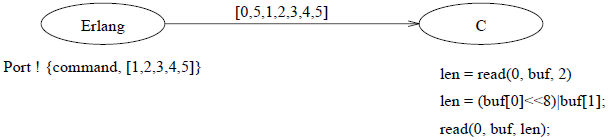

.. highlight:: erlang
    :linenothreshold: 3

**********
第9章 杂项
**********

:翻译: 连城

本章包含：

- 末尾调用优化——一种令尾递归程序得以在常数空间内执行的优化技术。
- 引用——提供确保在所有节点上都唯一的名称。
- 代码替换——在嵌入式实时系统中必须做到代码的\ **运行时**\ 替换，即是说，系统不能停机。
- 端口——提供和外部世界通讯的机制。
- 二进制数据——用于操作无类型内存区域的内建数据类型。
- 进程字典——用于破坏性地存取进程全局数据。\ [*]_
- 网络内核——网络内核用于协调分布式Erlang系统中的所有网络操作。
- 散列——一种将项式映射到唯一的整数用以实现高效的表查询操作的方法。
- 效率——我们将讨论如何编写高效的Erlang程序。

.. [*] 译者注：此处的“破坏性”指的是进程字典可被修改，从而破坏了Erlang函数式语法的变量不变性。

末尾调用优化
------------

Erlang支持\ **末尾调用优化**\ ，从而使得函数得以在固定大小的空间内执行。存储持久数据的主要手法是将之存储于由服务器进程操纵的结构中（典型实例参见第??节）。为了令这种手法得以正常工作，服务器必须利用末尾调用优化。

如果不这么做，服务器最终将会耗尽内存空间从而无法正常工作。

尾递归
~~~~~~

我们通过展示同一个函数的两种不同风格的写法来引入\ **尾递归**\ 的概念，其中一种写法是尾递归的形式。考察定义如下的\ ``length``\ 函数：

.. code-block:: erlang

    length([_|T]) ->
        1 + length(T);
    length([]) ->
        0.

我们不妨对\ ``legth([a, b, c])``\ 求值。\ ``length``\ 的第一个子句将问题归结为对\ ``1 + length([b, c])``\ 求值。不幸的是，\ ``+``\ 运算无法\ **立即**\ 执行，而是得\ **延迟**\ 到\ ``length([b, c])``\ 求值完毕为止。系统必须\ **记住**\ 这个\ ``+``\ 运算并在后续的某个阶段（此时已知\ ``length([b,c])``\ 的值）系统\ **回溯**\ 至该执行这个\ ``+``\ 运算时再实际执行运算。

**未决**\ 的运算被保存于局部数据区。这块区域的包含至少\ ``K * N``\ 个位置（其中\ ``K``\ 是一个常数，代表对\ ``length``\ 进行一次全新求值所需空间的大小，\ ``N``\ 是未决的运算数量）。

现在我们再写一个等价的求列表长度的函数，其中使用了一个累加器（参见第??节）。该函数仅占用固定大小的空间（为避免混淆，我们将之记为\ ``length1``\ ）：

.. code-block:: erlang

    length1(L) ->
        length1(L, 0).

    length1([_|T], N) ->
        length1(T, 1 + N);
    length1([], N) ->
        N.

要求\ ``length1([a, b, c])``\ ，我们首先求\ ``length1([a, b, c], 0)``\ 。再归结为\ ``length1([b, c], 1 + 0)``\ 。现在\ ``+``\ 运算可以\ **立即**\ 执行了（因为所有\ **参数**\ 都已知）。于是，计算\ ``length1([a, b, c])``\ 的函数求值过程为：

.. code-block:: erlang

    length1([a, b, c])
    length1([a, b, c], 0)
    length1([b, c], 1 + 0)
    length1([b, c], 1)
    length1([c], 1 + 1)
    length1([c], 2)
    length1([], 1 + 2)
    length1([], 3)
    3

**尾递归函数**\ 就是在递归调用前不累计任何未决运算的函数。如果函数子句中函数体的最后一个表达式是对自身的调用或者是个常数，那么它就是尾递归子句。如果一个函数的所有子句都是尾递归子句，那么它就是一个尾递归函数。

例如：

.. code-block:: erlang

    rev(X) -> rev(X, []).

    rev([], X) -> X;
    rev([H|T], X) -> rev(T, [H|T]).

该函数就是尾递归函数，但：

.. code-block:: erlang

    append([], X) -> X;
    append([H|T], X) -> [H | append(T,X)].

就不是尾递归函数，因为第二个子句的最后一个表达式（\ ``[H | append(T,X)]``\ 中的\ ``|``\ ）既不是对\ ``append``\ 的调用，也不是常数。

末尾调用优化
~~~~~~~~~~~~

尾递归是更泛化的\ **末尾调用优化**\ （Last Call Optimisation，LCO）的一个特例。末尾调用优化可应用于任何函数子句最后一个表达式为函数调用的情况。

例如：

.. code-block:: erlang

    g(X) ->
        ...
        h(X).

    h(X) ->
        ...
        i(X).

    i(X) ->
        
        g(X).

上述代码定义了一组三个相互递归的函数。LCO使得对\ ``g(X)``\ 的求值可以在常数空间内完成。

仔细翻阅本书的所有服务程序示例代码会发现，这些程序都可以在常数空间\ [#]_\ 内执行。

引用
----

**引用**\ 是全局唯一的对象。BIF ``make_ref()``\ 返回全局唯一的对象，该对象与系统中以及所有其他（可能存在的）运行着的节点中的所有对象都不相等。针对引用的唯一运算就是相等比较。

例如，我们可以在客户端—服务器模型中采用如下的接口函数：

.. code-block:: erlang

    request(Server, Req) ->
        Server ! {R = make_ref(), self(), Req},
            receive
                {Server, R, Reply} ->
                    Reply
            end.

``request(Server, Req)``\ 向名称为\ ``Server``\ 的服务器发送请求\ ``Req``\ ；请求中包含一个唯一引用\ ``R``\ 。在接收服务器返回的应答时会校验是否存在该唯一引用\ ``R``\ 。与服务器端的这种“端对端”的通讯方法可用于确认请求是否已被处理。

代码替换
--------

在嵌入式实时系统中，我们希望在不停机的情况下进行代码升级。比如我们希望在不影响服务的情况下修复某台大型交换机中的软件错误。

在运营过程中进行代码替换是“软”实时控制系统的普遍需求，这些系统往往运营时间很长，代码体积也很大。而在特殊处理器上运行或烧录在ROM里的硬实时系统则往往没有这种需求。

代码替换实例
~~~~~~~~~~~~

考察程序9.1。

我们首先编译并加载\ ``code_replace``\ 的代码。然后我们启动程序，并向创建出来的进程发送消息\ ``hello``\ 、\ ``global``\ 和\ ``process``\ 。

.. topic:: 程序9.1

    .. code-block:: erlang

        -module(code_replace).
        -export([test/0, loop/1]).

        test() ->
            register(global, spawn(code_replace, loop, [0])).

        loop(N) ->
            receive
                X ->
                    io:format('N = ~w Vsn A received ~w~n', [N, X])
            end,
            code_replace:loop(N+1).

最后我们再次编辑程序，将版本号从\ ``A``\ 改为\ ``B``\ ，重新编译、加载程序，并向进程发送消息\ ``hello``\ 。

会话结果如下：

.. code-block:: erlang

    %%% start by compiling and loading the code
    %%%   (this is done by c:c)
    > c:c(code_replace).
    ...
    > code_replace:test().
    true
    > global ! hello.
    N = 0 Vsn A received hello
    hello
    > global ! global.
    N = 1 Vsn A received global
    global
    > global ! process.
    N = 2 Vsn A received process
    %%% edit the file code_replace.erl
    %%% recompile and load
    > c:c(code_replace).
    ....
    > global ! hello.
    N = 3 Vsn B received hello

这里我们看到，在\ ``loop/1``\ 的执行过程中，虽然我们重新编译、加载了它的代码，但作为\ ``loop/1``\ 的参数的局部变量\ ``N``\ 的值仍被保留了下来。

注意服务器循环的代码是以如下形式编写的：

.. code-block:: erlang

    -module(xyz).

    loop(Arg1, ..., ArgN) ->
        receive
            ...
        end,
        xyz:loop(NewArg1, ..., NewArgN).

这与下面这样的写法有细微的差异：

.. code-block:: erlang

    -module(xyz).

    loop(Arg1, ..., ArgN) ->
        receive
            ...
        end,
        loop(NewArg1, ..., NewArgN).

第一种情况中调用\ ``xyz:loop(...)``\ 意味着总是使用模块\ ``xyz``\ 中\ **最新**\ 的\ ``loop``\ 版本。第二种情况中（不显式指定模块名）则只调用\ **当前执行模块**\ 中的\ ``loop``\ 版本。

显式使用模块限定名（\ ``module:func``\ ）使得\ ``module:func``\ **动态**\ 链接至运行时代码。对于使用完整模块限定名的调用，系统\ **每次**\ 都会使用最新版本的可用代码进行函数求值。模块中本地函数的地址解析在编译期完成——它们是\ **静态**\ 的，不能在运行时改变。

上述会话示例中\ ``c:c(File)``\ 编译并加载\ ``File``\ 中的代码。在第??节对此有详细讨论。

端口
----

端口提供了与外部世界通讯的基本机制。用Erlang编写的应用程序往往需要与Erlang系统之外的对象交互。还有一些现存的软件包，例如窗口系统、数据库系统，或是使用C、Modula2等其他语言的程序，在使用它们构建复杂系统时，也往往需要给它们提供Erlang接口。

从程序员的视角来看，我们希望能够以处理普通Erlang程序的方式来处理Erlang系统外的所有活动。为了创造这样的效果，我们需要将Erlang系统外的对象伪装成普通的Erlang进程。\ **端口**\ （Port），一种为Erlang系统和外部世界提供面向字节的通讯信道的抽象设施，就是为此而设计的。

执行\ ``open_port(PortName, PortSettings)``\ 可以创建一个端口，其行为与进程类似。执行\ ``open_port``\ 的进程称为该端口的\ **连接进程**\ 。需要发送给端口的消息都应发送至连接进程。外部对象可以通过向与之关联的端口写入字节序列的方式向Erlang系统发送消息，端口将给连接进程发送一条包含该字节序列的消息。

系统中的任意进程都可以与一个端口建立链接，端口和Erlang进程间的\ ``EXIT``\ 信号导致的行为与普通进程的情况完全一致。端口只理解\ **三种**\ 消息：

.. code-block:: erlang

    Port ! {PidC, {command, Data}}
    Port ! {PidC, {connect, Data}}
    Port ! {PidC, close}

``PidC``\ **必须**\ 是一个连接进程的\ ``Pid``\ 。这些消息的含义如下：

``{command, Data}``

    将\ ``Data``\ 描述的字节序列发送给外部对象。\ ``Data``\ 可以是单个二进制对象，也可以是一个元素为\ ``0..255``\ 范围内的整数的非扁平列表\ [#]_\ 。没有响应。

``close``

    关闭端口。端口将向连接进程回复一条\ ``{Port, closed}``\ 消息。

``{connect, Pid1}``

    将端口的连接进程换位\ ``Pid1``\ 。端口将向先前的连接进程发送一条\ ``{Port, connected}``\ 消息。 

此外，连接进程还可以通过以下方式接收数据消息：

.. code-block:: erlang

    receive
        {Port, {data, Data}} ->
            ... an external object has sent data to Erlang ...
        ...
    end

在这一节中，我们将描述两个使用端口的程序：第一个是在Erlang工作空间\ **内部**\ 的Erlang进程；第二个是在Erlang\ **外部**\ 执行的C程序。

打开端口
~~~~~~~~

打开端口时可以进行多种设置。BIF ``open_port(PortName, PortSettings``\ 可用于打开端口。\ ``PortName``\ 可以是：

``{spawn, Command}``

    启动名为\ ``Command``\ 的\ **外部**\ 程序或驱动。Erlang驱动在附录E中有所描述。若没有找到名为\ ``Command``\ 的驱动，则将在Erlang工作空间的外部运行名为\ ``Command``\ 的外部程序。

``Atom``

    ``Atom``\ 将被认作是外部资源的名称。这样将在Erlang系统和由该原子式命名的资源之间建立一条透明的连接。连接的行为取决于资源的类型。如果\ ``Atom``\ 表示一个文件，则一条包含文件全部内容的消息会被发送给Erlang系统；向该端口写入发送消息便可向文件写入数据。

``{fd, In, Out}``

    令Erlang进程得以访问任意由Erlang打开的文件描述符。文件描述符\ ``In``\ 可作为标准输入而\ ``Out``\ 可作为标准输出。该功能很少使用：只有Erlang操作系统的几种服务（\ ``shell``\ 和\ ``user``\ ）需要使用。注意该功能与仅限于UNIX系统。

``PortSettings``\ 是端口设置的列表。有效的设置有：

``{packet, N}``

    消息的长度将以大端字节序附在消息内容之前的\ ``N``\ 个字节内。\ ``N``\ 的有效取值为\ ``1``\ 、\ ``2``\ 或\ ``4``\ 。

``stream``

    输出的消息不附带消息长度──Erlang进程和外部对象间必须使用某种私有协议。

``use_stdio``

    仅对\ ``{spawn, Command}``\ 形式的端口有效。令产生的（UNIX）进程使用标准输入输出（即文件标识符\ ``0``\ 和\ ``1``\ ）与Erlang通讯。

``nouse_stdio``

    与上述相反。使用文件描述符\ ``3``\ 、\ ``4``\ 与Erlang通讯。

``in``

    端口仅用于输入。

``out``

    端口仅用于输出。

``binary``

    端口为二进制端口（后续将详述）。

``eof``

    到达文件末尾后端口不会关闭并发送\ ``'EXIT'``\ 信号，而是保持打开状态并向端口的连接进程发送一条\ ``{Port, eof}``\ 消息，之后连接进程仍可向端口输出数据。

除了\ ``{spawn, Command}``\ 类型的端口默认使用\ ``use_stdio``\ 外，*所有*\ 类型的端口默认都使用\ ``stream``\ 。

Erlang进程眼中的端口
~~~~~~~~~~~~~~~~~~~~

程序9.2定义了一个简单的Erlang进程，该进程打开一个端口并向该端口发送一串消息。与端口相连的外部对象会处理并回复这些消息。一段时间之后进程将关闭端口。

.. topic:: 程序9.2

    .. code-block:: erlang
    
        -module(demo_server).
        -export([start/0]).

        start() ->
            Port = open_port({spawn, demo_server}, [{packet, 2}]),
            Port ! {self(), {command, [1,2,3,4,5]}},
            Port ! {self(), {command}, [10,1,2,3,4,5]},
            Port ! {self(), {command, "echo"}},
            Port ! {self(), {command, "abc"}},
            read_replies(Port).

        read_replies(Port) ->
            receive
                {Port, Any} ->
                    io:format('erlang received from port:~w~n', [Any]),
                    read_replies(Port)
            after 2000 ->
                    Port ! {self(), close},
                    receive
                        {Port, closed} ->
                            true
                    end
            end.

程序9.2中的\ ``open_port(PortName, PortSettings``\ 启动了一个\ **外部**\ 程序。\ ``demo_server``\ 是即将运行的程序的名字。

表达式\ ``Port ! {self(), {command, [1,2,3,4,5]}}``\ 向外部程序发送了五个字节（值为1、2、3、4、5）。

为了让事情有意思一点，我们令外部程序具备一下功能：

- 若程序收到字符串“echo”，则它会向Erlang回复“ohce”。
- 若程序收到的数据块的第一个字节是10，则它会将除第一个字节以外的所有字节翻倍后返回。
- 忽略其他数据。

运行该程序后我们得到以下结果：

.. code-block:: erlang

    > demo_server:start().
    erlang received from port:{data,[10,2,4,6,8,10]}
    erlang received from port:{data,[111,104,99,101]}
    true

外部进程眼中的端口
~~~~~~~~~~~~~~~~~~

.. topic:: 程序9.3

    .. literalinclude:: part-i_program-9.3.c
        :language: c

程序9.3通过表达式\ ``len = read_cmd(buf)``\ 读取发送至Erlang端口的字节序列，并用\ ``write_cmd(buf, len)``\ 将数据发回Erlang。

文件描述符0用于从Erlang读取数据，而文件描述符1用于向Erlang写入数据。各个C函数的功能如下：

``read_cmd(buf)``

    从Erlang读取一条命令。

``write_cmd(buf, len)``

    向Erlang写入一个长度为\ ``len``\ 的缓冲区。

``read_exact(buf, len)``

    读取\ ``len``\ 个字节。

``write_exact(buf, len)``

    写入\ ``len``\ 个字节。

``put_int16(i, s)``

    将一个16位整数打包为两个字节。

函数\ ``read_cmd``\ 和\ ``write_cmd``\ 假设外部服务和Erlang间的协议由一个指明数据包长度的双字节包头和紧随的数据构成。如图9.1所示。

      图9.1 端口通讯

之所以使用这种协议（双字节包头加数据）是由于端口是以如下方式打开的：

.. code-block:: erlang

    open_port({spawn, demo_server}, [{packet, 2}])

二进制类型
----------

二进制类型是一种用于存储无类型内存区域的数据类型。若\ ``open_port/2``\ 的最后一个参数\ ``Settings``\ 列表中包含原子式\ ``binary``\ ，则打开的端口便是二进制端口。来自二进制端口的消息都是二进制类型的数据。

为了说明二进制端口和普通端口的区别，我们用“双字节包头加数据”协议从外部进程向Erlang发送字符串\ ``"hello"``\ 。外部程序将输出如下字节序列：

.. code-block:: erlang

    0 5 104 101 108 108 111

若与Erlang进程相连的端口是普通端口，则会向向进程发送消息\ ``{Port, {data, [104, 101, 108, 108, 111]}}``\ 。若是二进制端口，消息则是\ ``{Port, {data, Bin}}``\ ，其中\ ``Bin``\ 是长度为5的二进制数据对象，内容即为消息中的字节数据。注意，在这两种情况下，向端口发送数据的外部进程没有区别。

令端口发送二进制对象而非列表的好处在于，相对于长列表，构造和发送二进制数据的速度要快很多。

下列BIF可用于二进制操作：

``term_to_binary(T)``

    将项式\ ``T``\ 转为二进制。得到的二进制数据对象为该项式的\ **外部项式格式**\ 表示。

``binary_to_term(Bin)``

    与\ ``term_to_binary/1``\ 相反。

``binary_to_list(Bin)``

    将二进制对象\ ``Bin``\ 转为证书列表。

``binary_to_list(Bin, Start, Stop)``

    将二进制对象从\ ``Start``\ 到\ ``Stop``\ 的部分转为整数列表。二进制对象的位置下标从1开始计算。

``list_to_binary(Charlist)``

    将\ ``Charlist``\ 转为二进制数据对象。与\ ``term_to_binary(Charlist)``\  不同，该BIF构造的是一个包含\ ``Charlist``\ 所包含的字节序列的二进制对象，而前者是针对\ **项式**\ ``Charlist``\ 构造一个外部项式格式的二进制对象。

``split_binary(Bin, Pos)``

    将\ ``Bin``\ 从\ ``Pos``\ 处切分为两个新的二进制对象。得到的是包含两个新二进制对象的元组。例如：

    .. code-block:: erlang

        1> B = list_to_binary("0123456789").
        #Bin
        2> size(B).
        10
        3> {B1,B2} = split_binary(B,3).
        {#Bin,#Bin}
        4> size(B1).
        3
        5> size(B2).
        7

``concat_binary(ListOfBinaries)``

    构造一个串接二进制对象列表\ ``ListOfBinaries``\ 中的所有二进制对象的新二进制对象。

另外，保护式\ ``binary(X)``\ 在\ ``X``\ 为二进制数据对象时返回成功。二进制对象主要用于网络中的代码加载，但也可用于那些需要处理大量音视频数据等原始数据的应用。通常可以高效地通过端口输入大量二进制数据，完成数据处理后，再输出到另一个或原先的端口。

进程字典
--------

每个进程都拥有一个字典。通过下列BIF可以操作该字典：

``put(Key, Value)``

    将与键\ ``Key``\ 相关联的新值\ ``Value``\ 加入进程字典。若与\ ``Key``\ 相关联的值已经存在则该值将被删除并被新值\ ``Value``\ 替代。该BIF返回原先与\ ``Key``\ 关联的值，若原先没有值与\ ``Key``\ 相关联，则返回\ ``undefined``\ 。\ ``Key``\ 和\ ``Value``\ 可以是任意的Erlang项式。

``get(Key)``

    返回进程字典中与\ ``Key``\ 关联的值。若没有值与\ ``Key``\ 相关联则返回\ ``undefined``\ 。

``get()``

    以\ ``{Key, Value}``\ 元组列表的形式返回整个进程字典。

``get_keys(Value)``

    返回一个列表，包含进程字典中值为\ ``Value``\ 的所有的键。

``erase(Key)``

    返回整个进程字典后将至删除。

对于各个进程而言进程字典是\ **局部**\ 的。进程刚被创建时进程字典为空。任何函数都可通过调用\ ``put(Key, Value)``\ 向字典中添加\ ``{Key, Value}``\ 键值对，而后再通过调用\ ``get(Key)``\ 取出。在\ ``catch``\ 作用域内，若在调用\ ``put``\ 后调用\ ``throw``\ 或出现错误，放入字典的值不会被撤回。

借助\ ``get()``\ 和\ ``erase()``\ 可以获取或删除整个字典。删除单个条目可用\ ``erase(Key)``\ 。

有时候我们希望在多个不同函数中访问同一块全局数据，而将之作为进程中所有函数的参数来进行传递又不太方便。小心使用\ ``put``\ 和\ ``get``\ 就可以避免这个问题。

``get``\ 和\ ``set``\ 在语言中引入了破坏性操作，令程序员写出具有副作用的函数。这些函数的调用结果可能跟它们的调用次序相关。对进程字典的使用应该\ **非常小心**\ 。\ ``get``\ 和\ ``set``\ 就好比传统命令式语言里的\ *goto*\ 。\ ``get``\ 和\ ``set``\ 在某些特定场景下很有用，但使用它们会造成不清晰的代码，应该尽可能地避免使用。鉴于不鼓励使用进程字典，本书的所有程序都不使用进程字典——为了内容完整，只在此处和附录中包含相关内容。

网络内核
--------

``net_kernel``\ 进程被用于协调分布式Erlang系统。运行时系统会自动向\ ``net_kernel``\ 发送某些消息。在该进程中执行的代码决定对于不同的系统消息应该采取何种动作。

Erlang系统可在两种模式下运行。它可以作为一个不与其他Erlang系统通讯的封闭系统运行，也可以同其他系统进行通讯，这时我们认为它\ **存活**\ 着。通过调用BIF  ``alive/2``\ 可以令系统活过来。通常这是由Erlang操作系统而不是用户完成的。以下调用：

.. code-block:: erlang

    erlang:alive(Name, Port)

将通知网络命名服务一个Erlang系统已经启动并可以参与分布式计算了。

``Name``\ 是一个用于标识该Erlang系统的本地名称。该Erlang系统的外部名称为\ ``Name@MachineName``\ ，其中\ ``MachineName``\ 是节点所在的机器名，而字符“\ ``@``\ ”用于分隔本地名称与机器名。例如，在名为\ ``super.eua.ericsson.se``\ 的主机上调用\ ``erlang:alive(foo,Port)``\ 将会启动一个名为\ ``foo@super.eua.ericsson.se``\ 的Erlang系统，该名称全局唯一。在同一台机器上可以同时运行多个本地名不同的Erlang系统。

``Port``\ 是一个Erlang端口。外部端口程序必须遵从Erlang分布式系统的内部协议。该程序负责所有的网络操作，如建立与远程节点间的通讯信道以及向这些节点的字节缓冲区读写数据。不同版本的端口程序允许Erlang节点采用不同的网络技术进行通讯。

执行\ ``alive/2``\ 将使执行该表达式的进程被加入一个可参与分布式计算的Erlang节点池。执行\ ``alive/2``\ 的进程必须以\ ``net_kernel``\ 为名进行注册。否则，该BIF调用会失败。要将一个节点从网路中断开，可以关闭分布式端口。

BIF ``is_alive()``\ 可用于检测一个节点是否存活。该BIF返回\ ``true``\ 或\ ``false``\ 。

一旦有新节点出现，\ ``net_kernel``\ 就会收到一条\ ``{nodeup, Node}``\ 消息；一旦有节点失败，\ ``net_kernel``\ 也相应会收到一条\ ``{nodedown, Node}``\ 消息。所有调用\ ``spawn/4``\ 或\ ``spawn_link/4``\ 的进程创建请求以及所有采用\ ``{Name, Node} ! Message``\ 结构向远程注册进程发送消息的请求都会经过\ ``net_kernel``\ 进程。这使得用户可以通过自定义\ ``net_kernel``\ 代码来达成多种目的。例如，BIF ``spawn/4``\ 实际上是用Erlang自身实现的。在远程节点创建进程的客户端代码为：

.. code-block:: erlang

    spawn(N,M,F,A) when N /= node() ->
        monitor_node(N, true),
        {net_kernel, N} ! {self(), spawn, M, F, A, group_leader()},
        receive
            {nodedown, N} ->
                R = spawn(erlang, crasher, [N,M,F,A,noconnection]);
            {spawn_reply, Pid} ->
                R = Pid
        end,
        monitor_node(N, false),
        R;
    spawn(N,M,F,A) ->
        spawn(M,F,A).

    crasher(Node,Mod,Fun,Args,Reason) ->
        exit(Reason).

这段代码的效果是向远程节点上的\ ``net_kernel``\ 进程发送一条消息。远程的\ ``net_kernel``\ 负责创建新进程，并告知客户端新进程的Pid。

认证
~~~~

Erlang系统采用“magic cookies”的方式内建了认证支持。Magic cookie是分配给各个节点的一个保密原子式。每个节点在启动时都会被自动分配一个随机cookie。节点\ ``N1``\ 要想和节点\ ``N2``\ 通讯，就必须知道\ ``N2``\ 的magic cookie。这里不讨论\ ``N1``\ 如何找出\ ``N2``\ 的cookie。为了令\ ``N1``\ 得以和\ ``N2``\ 通讯，\ ``N1``\ 必须执行\ ``erlang:set_cookie(N2, N2Cookie)``\ ，其中\ ``N2Cookie``\ 是\ ``N2``\ 的cookie值。另外，要令\ ``N1``\ 能够收到来自\ ``N2``\ 的响应，\ ``N2``\ 也必须执行\ ``erlang:set_cookie(N1, N1Cookie``\ ，其中\ ``N1Cookie``\ 是\ ``N1``\ 的cookie值。

Erlang运行时系统会将cookie插入到发送给所有远程节点的所有消息中。若一条消息抵达某节点时携带着错误的cookie，则运行时系统会将这条消息转换为以下格式：

.. code-block:: erlang

    {From,badcookie,To,Message}

其中\ ``To``\ 是消息接收方的Pid或注册名而\ ``From``\ 是发送方的Pid。所有未认证的消息发送请求和进程创建请求都会被转为\ ``badcookie``\ 消息并发送至\ ``net_kernel``\ 。\ ``net_kernel``\ 可以任意处置\ ``badcookie``\ 消息。

以下两个BIF可用于cookie操作：

``erlang:get_cookie()``

    返回自己的magic cookie。

``erlang:set_cookie(Node,Cookie)``

    将节点\ ``Node``\ 的magic cookie设置为\ ``Cookie``\ 。获得\ ``Node``\ 的cookie后可以使用该BIF。它将令后续发送给\ ``Node``\ 的所有消息都包含\ ``Cookie``\ 。如果\ ``Cookie``\ 确实是\ ``Node``\ 的magic cookie，则消息将直接被发送至\ ``Node``\ 上的接收进程。如果包含的cookie有误，该消息将在接收端被转为\ ``badcookie``\ 消息，再被发送至那里的\ ``net_kernel``\ 。

默认情况下，所有节点都假定所有其他节点的cookie是原子式\ ``nocookie``\ ，因此初始时所有的远程消息都包含cookie ``nocookie``\ 。

若调用\ ``erlang:set_cookie(Node, Cookie)``\ 时\ ``Node``\ 的值为本地节点的名字，则本地节点的magic cookie将被设置为\ ``Cookie``\ ，同时，其他所有cookie值为\ ``nocookie``\ 的节点都会变为\ ``Cookie``\ 。如果所有节点都在启动时执行：

.. code-block:: erlang

    erlang:set_cookie(node(), SecretCookie),

则它们将自动互相认证以便协作。应用如何获取到\ ``SecretCookie``\ 是一个实现问题。保密cookie应保存于一个仅能由用户读取或仅能由用户组读取的文件中。

在UNIX环境下，节点启动后的默认行为是读取用户HOME目录下名为\ ``.erlang.cookie``\ 的文件。首先将会对文件的保护权限进行检查，然后便会调用\ ``erlang:set_cookie(node(), Cookie)``\ ，其中\ ``Cookie``\ 是包含cookie文件内容的原子式。之后，同一用户就可以安全地与其他所有在相同用户ID下运行的Erlang节点进行通讯了（假设所有节点都在同一文件系统下运行）。如果节点驻留在不同的文件系统中，用户只须保证涉及到的文件系统中的cookie文件的内容相同即可。

net_kernel消息
~~~~~~~~~~~~~~

以下是可以发送给\ ``net_kernel``\ 的消息的列表：

- ``{From,registered_send,To,Mess}`` 向注册进程\ ``To``\ 的发送消息\ ``Mess``\ 的请求。
- ``{From,spawn,M,F,A,Gleader}`` 创建新进程的请求。\ ``Gleader``\ 是请求发起方进程的group leader。
- ``{From,spawn_link,M,F,a,Gleader}`` 创建新进程并向新进程建立链接的请求。
- ``{nodeup,Node}`` 当系统中有新节点接入时，\ ``net_kernel``\ 就会收到该消息。这种情况既可能是某远程节点来联络我们，也可能是本地节点上的某个进程向该远程节点首次完成了一次远程操作。
- ``{nodedown,Node}`` 当某节点失败或从本地节点无法联络到某远程节点时，\ ``net_kernel``\ 就会收到该消息。
- ``{From,badcookie,To,Mess}`` 当有未认证请求发送到本节点时，\ ``net_kernel``\ 就会收到一条可表征该请求性质的消息。例如，某未认证节点发起了一个进程创建请求，\ ``net_kernel``\ 就会收到消息：

  .. code-block:: erlang

      {From,badcookie, net_kernel, {From,spawn,M,F,A,Gleader}}

散列
----

Erlang提供了一个可从任意项式产生一个整数散列值的BIF：

``hash(Term, MaxInt)``

    返回一个在\ ``1..MaxInt``\ 范围内的整数。

借助\ ``hash`` BIF我们可以编写一个高效的字典查询程序。该程序的接口与第??节的二叉树实现的字典几乎完全一样。

.. topic:: 程序9.4

    .. code-block:: erlang

        -module(tupleStore).
        -export([new/0,new/1,lookup/2,add/3,delete/2]).

        new() ->
            new(256).

        new(NoOfBuckets) ->
            make_tuple(NoOfBuckets, []).

        lookup(Key, Tuple) ->
            lookup_in_list(Key, element(hash(Key, size(Tuple)), Tuple)).

        add(Key, Value, Tuple) ->
            Index = hash(Key, size(Tuple)),
            Old   = element(Index, Tuple),
            New   = replace(Key, Value, Old, []),
            setelement(Index, Tuple, New).

        delete(Key, Tuple) ->
            Index = hash(Key, size(Tuple)),
            Old   = element(Index, Tuple),
            New   = delete(Key, Old, []),
            setelement(Index, Tuple, New).

        make_tuple(Length, Default) ->
            make_tuple(Length, Default, []).

        make_tuple(0, _, Acc) ->
            list_to_tuple(Acc);
        make_tuple(N, Default, Acc) ->
            make_tuple(N-1, Default, [Default|Acc]).

        delete(Key, [{Key,_}|T], Acc) ->
            lists:append(T, Acc);
        delete(Key, [H|T], Acc) ->
            delete(Key, T, [H|Acc]);
        delete(Key, [], Acc) ->
            Acc.

        replace(Key, Value, [], Acc) ->
            [{Key,Value}|Acc];
        replace(Key, Value, [{Key,_}|T], Acc) ->
            [{Key,Value}|lists:append(T, Acc)];
        replace(Key, Value, [H|T], Acc) ->
            replace(Key, Value, T, [H|Acc]).

        lookup_in_list(Key, []) ->
            undefined;
        lookup_in_list(Key, [{Key, Value}|_]) ->
            {value, Value};
        lookup_in_list(Key, [_|T]) ->
            lookup_in_list(Key, T).

该程序与程序??.4的唯一区别就在于函数\ ``new/1``\ ，我们需要向该函数传入散列表的大小。

程序??.4是传统散列查找程序的一个简单实现。散列表\ ``T``\ 由一个定长元组表示。为了查找项式\ ``Key``\ 对应的值，需要计算出一个介于\ ``1..size(T)``\ 之间的散列索引\ ``I``\ 。\ ``element(I, T)``\ 返回一个列表，包含散列索引相同的所有\ ``{Key, Value}``\ 键值对。在该列表中可以搜索到所需的\ ``{Key, Value}``\ 对。

向散列表中插入数据时，首先计算出\ ``Key``\ 的散列索引整数\ ``I``\ ，再向\ ``element(I, T)``\ 返回的列表中插入新的\ ``{Key, Value}``\ 对。原先与\ ``Key``\ 关联的值将被丢弃。

``tupleStore``\ 模块提供了高效的字典。为了提高访问效率散列表的大小必须大于表中所插入的元素的数目。从这种结构中进行查询非常高效，但插入就逊色些。这是因为大部分Erlang视线中BIF ``setelement(Index, Val, T)``\ 每次都会创建一个新的元组\ ``T``\ 。

效率
----

最后我们来讨论一下效率。这并不是说我们认为这个主题不重要，而是因为我们相信过早关注效率问题会导致不良的程序设计。关注重点应该一直放在程序的正确性上，为了达到这个目的，我们提倡开发简练漂亮且“明显”正确的算法。

作为示例，我们将展示如何将低效的程序改造为高效的程序。

作为练习，我们从一个包含某假象公司员工信息元组的文件开始，该文件的内容为：

.. code-block:: erlang

    {202191,’Micky’,’Finn’,’MNO’,’OM’,2431}.
    {102347,’Harvey’,’Wallbanger’,’HAR’,’GHE’,2420}.
    ... 2860 lines omitted ...
    {165435,’John’,’Doe’,’NKO’,’GYI’, 2564}.
    {457634,’John’, ’Bull’,’HMR’,’KIO’, 5436}.

我们要写一个程序来输入这些数据、将每个条目都放入字典、访问所有条目一遍，再将数据写回文件。这个程序将频繁执行，因此我们得让它尽可能地快。

文件访问
~~~~~~~~

从上述的元组文件中读入数据的最简单的方法就是使用\ ``file:consult(File)``\ 读取文件（参见附录C）——这个方法很耗时，因为每一行都会被读取和解析。一个好一点的做法是将输入文件从文本格式改为二进制格式。通过以下函数可以实现：

.. code-block:: erlang

    reformat(FileOfTerms, BinaryFile) ->
        {ok, Terms} = file:consult(FileOfTerms),
        file:write_file(BinaryFile, term_to_binary(Terms)).

要读入二进制文件并恢复原始数据，执行：

.. code-block:: erlang

    read_terms(BinaryFile) ->
        {ok, Binary} = file:read(BinaryFile),
        binary_to_term(Binary).

读取二进制文件并将结果转换为项式要比读取并解析一组项式要快得多，从下表便中可见一斑：

.. csv-table::
    :header: 文本大小(bytes), 二进制大小(bytes), ``file:consult`` (ms), ``read_terms`` (ms), 耗时比例

    128041, 118123, 42733, 783, 54.6
    4541, 4190, 1433, 16, 89.6

对于4.5K的文件，二进制文件读取要快90倍；对于128K的文件要快55倍。注意二进制文件要被文本文件小一些。

字典访问
~~~~~~~~

我们使用了不同的方法来构建和更新雇员字典。这些方法包括：

``lists``

    所有雇员记录都保存在一个列表中。在表头进行首次插入，其余更新对列表进行线性扫描。

``avl``

    采用第??节描述的AVL树插入算法。

``hash``

    采用程序9.4的散列算法。

为了检验不同方法的效率，我们对我们的每一条雇员数据都进行一次插入和查找，得到以下的计时结果：

.. csv-table::
    :header: 条目数, AVL插入, AVL查找, 列表插入, 列表查找, 散列插入, 散列查找

    25, 5.32, 0.00, 0.00, 0.64, 1.32, 0.00
    50, 1.32, 0.32, 0.00, 1.00, 0.32, 0.00
    100, 2.00, 0.50, 0.00, 1.50, 0.33, 0.16
    200, 9.91, 0.50, 0.00, 3.00, 2.08, 0.17
    400, 28.29, 0.46, 0.04, 5.96, 4.25, 0.09
    800, 301.38, 0.54, 0.02, 11.98, 1.77, 0.15
    1600, 1060.44, 0.61, 0.02, 24.20, 4.05, 0.14

上表中每次插入或查询的时间单位都是毫秒。我们看到对于大小超过800的数据表，散列表的查询效率是最高的。

上面我们看到使用二进制文件和散列查询算法要比使用\ ``file:consult``\ 和简单列表查询方法快六千倍。和传统命令式语言一样，决定程序效率的最重要因素还是良好的算法设计。

.. rubric:: 脚注

.. [#] 当然，要除去服务器用于存储本地数据结构的空间。
.. [#] 非扁平列表就是不含有子列表的列表。（译者注：也就是说当\ ``Data``\ 是一个整数列表时，既可以是\ ``[1,2,3]``\ 也可以是\ ``[1,[2,3]]``\ ，在这里二者是等价的。）

.. vim:ft=rst.erlang ts=4 sw=4 fenc=utf-8 enc=utf-8 et wrap
